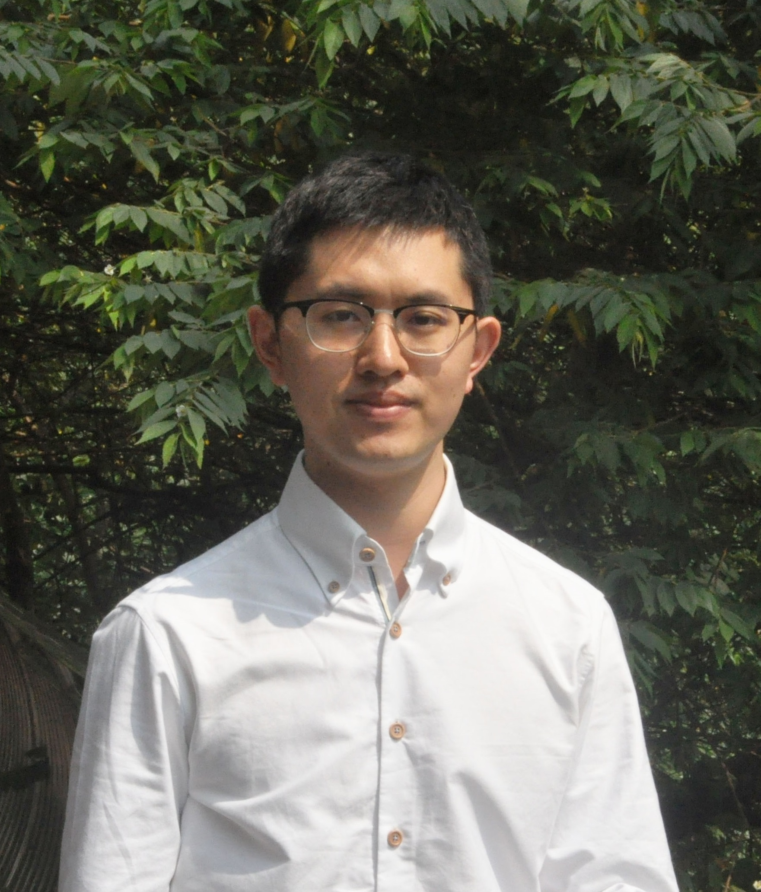

title: "Wei WANG"
layout: "page"
comments: false
---

Assistant Professor
[Computer Science](http://www.comp.nus.edu.sg/about/depts/cs)
[School of Computing](http://www.comp.nus.edu.sg)
[National University of Singapore](http://www.nus.edu.sg)

Email: wangwei At comp.nus.edu.sg
Tel: (65) 6601 3785
Office: COM2 Building, \#04-09, 15 Computing Drive, Singapore 117418

---

I am an Assistant Professor in the Department of Computer Science, National University of Singapore (NUS). I got my B.S. from Renmin University of China in 2011 and PhD from NUS in 2017. My research interests include machine learning system optimizations and multimedia applications. I am currently working on automated machine learning systems, and machine learning for malware detection.

---

# Recent News

* Dec, 2019. Two papers are accepted to [ICLR 2020](https://iclr.cc/Conferences/2020).
* Nov, 2019. I attended [CNA938 TechTalk](https://www.channelnewsasia.com/news/cna938) for a live radio interview about Apache SINGA and the applications.
* Nov, 2019. Three papers are accepted to [AAAI 2020](https://aaai.org/Conferences/AAAI-20/).
* Oct, 2019. Apache SINGA has become a Top-Level project under Apache Software Foundation. Media reports: [Strait Times](https://www.straitstimes.com/tech/nus-teams-ai-system-first-from-southeast-asia-to-enter-ranks-of-worlds-top-open-source-software), [ASF Blog](https://blogs.apache.org/foundation/entry/the-apache-software-foundation-announces57) and [others](https://cms.comp.nus.edu.sg/news/news-media/3176-2019-asf-singa). 

# Publications
* [Understanding Architectures Learnt by Cell-based Neural Architecture Search](https://openreview.net/forum?id=BJxH22EKPS).
  Yao Shu, Wei Wang, Shaofeng Cai. ICLR 2020. (Accepted)

* [Additive Powers-of-Two Quantization: A Non-uniform Discretization for Neural Networks](https://openreview.net/forum?id=BkgXT24tDS).
  Yuhang Li, Xin Dong, Wei Wang. ICLR 2020. (Accepted)

* [Dynamic Malware Analysis with Feature Engineering and Feature Learning](https://arxiv.org/abs/1907.07352).
  Zhaoqi Zhang, Panpan Qi, Wei Wang, Chang Yao. AAAI 2020. (Accepted)

* [One-Shot Image Classification by Learning to Restore Prototypes]().
  Wanqi Xue, Wei Wang. AAAI 2020. (Accepted)

* [RTN: Reparameterized Ternary Network]().
  Yuhang Li, Xin Dong, Sai Zhang, Haoli Bai, Yuanpeng Chen, Wei Wang. AAAI 2020. (Accepted)

* [5G: Agent for Further Digital Disruptive Transformations](http://sites.computer.org/debull/A19sept/p9.pdf).
  Beng Chin Ooi, Gang Chen, Dumitrel Loghin, Wei Wang, Meihui Zhang. IEEE Bulletin of the Technical Committee on Data Engineering, 43(3), 9-12, September 2019. 

* [Deploying Hash Tables on Die-Stacked High Bandwidth Memory](https://dl.acm.org/citation.cfm?id=3358015).
  Xuntao Cheng, Bingsheng He, Eric Lo, Wei Wang, Shengliang Lu and Xinyu Chen. CIKM 2019.

* [A Distributed System for Large-scale n-gram Language Models at Tencent](http://www.vldb.org/pvldb/vol12/p2206-long.pdf).
  Qiang Long, Wei Wang, Jinfu Deng, Song Liu, Wenhao Huang, Fangying Chen, and Sifan Liu. VLDB 2019.

* [ISBNet: Instance-aware Selective Branching Network](https://arxiv.org/abs/1905.04849).
  Shaofeng Cai, Yao Shu, Wei Wang and Beng Chin Ooi. 2019.

* [Effective and Efficient Dropout for Deep Convolutional Neural Networks](https://arxiv.org/abs/1904.03392).
  Shaofeng Cai, Jinyang Gao, Meihui Zhang, Wei Wang, Gang Chen, Beng Chin Ooi. 2019.

* [Rafiki: Machine Learning as an Analytics Service System](http://www.vldb.org/pvldb/vol12/p128-wang.pdf).
  Wei Wang, Sheng Wang, Jinyang Gao, Meihui Zhang, Gang Chen, Teck Khim Ng, Beng Chin Ooi, and Jie Shao. VLDB 2019.

* [Efficient Memory Management for GPU-based Deep Learning Systems](https://arxiv.org/abs/1903.06631).
  Junzhe Zhang, Sai Ho Yeung, Yao Shu, Bingsheng He, Wei Wang. 2019.

* [ScatterNet: A Deep Subjective Similarity Model for Visual Analysis of Scatterplots](https://www.comp.nus.edu.sg/~atung/publication/scatternet_draft.pdf).
  Yuxin Ma, Anthony K. H. Tung, Wei Wang, Xiang Gao, Zhigeng Pan, Wei Chen. Accepted in Transactions on Visualization and Computer Graphics 2018.

* [Capturing Feature-Level Irregularity in Disease Progression Modeling](http://www.comp.nus.edu.sg/~kaiping/2017-11-9-KaipingZheng-cikm.pdf).
  Kaiping Zheng, Wei Wang, Jinyang Gao, Kee Yuan Ngian, Beng Chin Ooi, and Wei Luen James Yip. CIKM 2017.

* [Cross-Domain Image Retrieval with Attention Modeling](https://arxiv.org/abs/1709.01784).
  Xin Ji, Wei Wang, Meihui Zhang, and Yang Yang. ACM Multimedia 2017.

* [Deep Learning at Scale and At Ease](http://delivery.acm.org/10.1145/3000000/2996464/a69-wang.pdf?ip=202.166.19.179&id=2996464&acc=OA&key=4D4702B0C3E38B35%2E4D4702B0C3E38B35%2E4D4702B0C3E38B35%2E15F56E1470BE2D9E&CFID=695246172&CFTOKEN=39222796&__acm__=1479539828_f80e20c334ffcbb5a1e5bba36a6a969c).
  Wei Wang, Gang Chen, Haibo Chen, Tien Tuan Anh Dinh, Jinyang Gao, Beng Chin Ooi, Kian-Lee Tan, and Sheng Wang.  ACM Transactions on Multimedia Computing Communications and Applications(TOMM) - Special Section on Best Papers of ACM Multimedia 2015, Volume 12 Issue 4s, November 2016.

* [Database Meets Deep Learning: Challenges and Opportunities](https://arxiv.org/abs/1906.08986).
  Wei Wang, Meihui Zhang, Gang Chen, H.V. Jagadish, Beng Chin Ooi, and Kian-Lee Tan. ACM SIGMOD Record, 2016.

* [SINGA: Putting Deep Learning in the Hands of Multimedia Users](http://www.comp.nus.edu.sg/~ooibc/singa-mm15.pdf).
  Wei Wang, Gang Chen, Tien Tuan Anh Dinh, Jinyang Gao, Beng Chin Ooi, Kian-Lee Tan, and Sheng Wang. ACM Multimedia 2015. Best paper candidate.

* [SINGA: A Distributed Deep Learning Platform](http://www.comp.nus.edu.sg/~ooibc/singaopen-mm15.pdf).
  Beng Chin Ooi, Kian-Lee Tan, Sheng Wang, Wei Wang, Qingchao Cai, Gang Chen, Jinyang Gao, Zhaojing Luo, Anthony K. H. Tung, Yuan Wang, Zhongle Xie, Meihui Zhang, and Kaiping Zheng. ACM Multimedia (Open Source Software Competition) 2015, [project](http://singa.apache.org/).

* [Effective Deep Learning Based Multi-Modal Retrieval](http://link.springer.com/article/10.1007/s00778-015-0391-4?wt_mc=email.event.1.SEM.ArticleAuthorOnlineFirst).
  Wei Wang, Xiaoyan Yang, Beng Chin Ooi, Dongxiang Zhang, and Yueting Zhuang. VLDB Journal - Special issue of VLDB'14 best papers, 2015, [code](https://github.com/nudles/vldbj-code).

* [Effective multi-modal retrieval based on stacked autoencoders](http://www.comp.nus.edu.sg/~ooibc/crossmodalvldb14.pdf).
  Wei Wang, Xiaoyan Yang, Beng Chin Ooi, Dongxiang Zhang, and Yueting Zhuang. VLDB 2014. Best paper candidate, VLDB 2014. Best paper candidate, [project](2015/05/03/msae).

* Cross-media hashing with neural networks.
  Yueting Zhuang, Zhou Yu, Wei Wang, Fei Wu, Siliang Tang, and Jian Shao. ACM Multimedia 2014 (short paper).

* Continuously monitoring the correlations of massive discrete streams.
  Yueguo Chen, Wei Wang, Xiaoyong Du, and Xiaofang Zhou. CIKM 2011 (short paper).

---

# Projects
* [Rafiki](https://github.com/nginyc/rafiki). AutoML system with optimization on hyper-parameter tuning and model inference.
* [Singa](http://singa.apache.org). Apache incubator project for developing a distributed deep learning system.
* [Foodlg](http://www.foodlg.com/). A health tracking and analysis App based on deep learning.

---

# Professional Activities
* Reviewer of TKDE, Neurocomputing and ACM Transactions on Data Science.
* Area Chair of ICDCS 2020
* Program Committee member of ICDE 2020
* Program Committee member of DASFFA 2020
* Program Committee member of DASFFA 2019
* Program Committee member of ACM Multimedia 2019
* Program Committee member of VLDB 2018
* Program Committee member of ICDE 2018
* Program Committee member of DASFFA 2017
* Program Committee member of ACM Multimedia 2015
